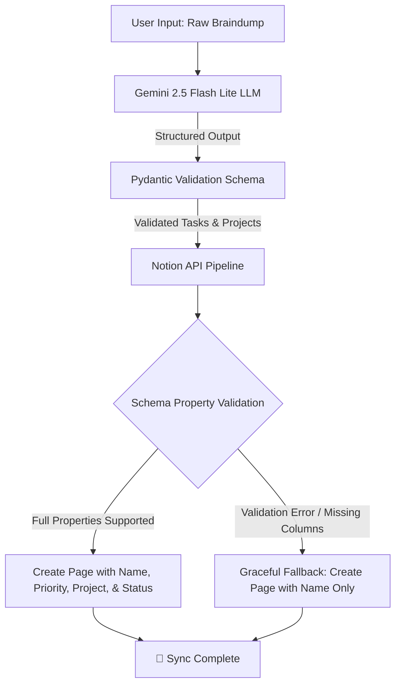

# 🌌 Notion Braindump Agent (v1.0.0)

A highly resilient Python pipeline that turns unstructured raw text dumps ("braindumps") into structured projects and tasks, pushing them automatically into your Notion database using the power of Google Gemini LLMs.

---

## 🛠️ Key Features

- **Brain-to-Structure Extraction:** Uses Google's ultra-fast `gemini-2.5-flash-lite` with strict Pydantic schemas to validate and extract structured tasks and projects.
- **Smart Project Linking:** Intuitively maps extracted tasks to parent projects (`project_title`) mentioned in the braindump.
- **Dynamic Notion Sync:** Translates structured python payloads into Notion page properties using the official `notion-client` SDK.
- **Schema-Agnostic Resiliency (New):** Features an automated fallback system. If your Notion database lacks advanced columns like `Priority`, `Project`, or `Status`, the pipeline automatically catches the validation error and gracefully logs the task using only the `Name` property.

---

## 📐 Architecture & Flow



---

## 🚀 Quick Start

### 1. Prerequisites
Ensure you have [uv](https://github.com/astral-sh/uv) (fast Python package manager) installed:
```bash
# Check if uv is installed
uv --version
```

### 2. Environment Configuration
Create a `.env` file in the root directory (this is ignored by Git to keep your credentials safe):
```ini
GEMINI_API_KEY="your-gemini-api-key"
NOTION_TOKEN="your-notion-integration-token"
NOTION_DATABASE_ID="your-notion-database-uuid"
```

### 3. Running the Pipeline
You can execute the pipeline instantly with `uv`. It will handle all dependency installations and run the pipeline:

```bash
uv run main.py
```

---

## 📥 Example Usage

**Input Text Dump:**
> I need to finalize the product proposal for Codénix by tonight. Also have to review the new Agentic AI coursework modules this weekend. Remind me to look up the chords for that Zubeen Garg song and update the Bio-Mechanical Guitar AI repo on GitHub with the latest tablature scripts.

**Terminal Execution Trace:**
```text
--- Notion Braindump Agent Pipeline Initialized ---

Enter your text dump below (Press Enter, then Ctrl+D or Ctrl+Z to finish):
Processing Braindump through Gemini........

✨ Extraction Complete! Found 4 distinct tasks.

[1/4] Processing...
🚀 Pushing task to Notion: 'Finalize product proposal' [Codénix Product Proposal]
⚠️ Missing columns in Notion database, falling back to 'Name' only...
✅ Successfully created page (Name only) for: Finalize product proposal

...

🎉 All tasks have been successfully processed and pushed to Notion!
```

---

## 📦 Project Structure

```text
├── .env                # Private API Keys (Excluded from Git)
├── .gitignore          # Git exclusion rules
├── .python-version     # Target python runtime
├── pyproject.toml      # Dependency & project specs
├── README.md           # Documentation (this file)
├── requirements.txt    # Lock file reference
└── main.py             # Pipeline source code
```

---

## 🗺️ Version 2 Roadmap

- [ ] **Database Schema Builder:** Auto-create `Priority` (Select), `Project` (Rich Text), and `Status` (Status) columns inside the target Notion database if they do not exist.
- [ ] **Dual Database Syncing:** Maintain a separate Notion database for *Projects* and relate the *Tasks* database pages to the *Projects* database pages.
- [ ] **Web UI Dashboard:** A polished browser-based interface utilizing modern glassmorphism design.
